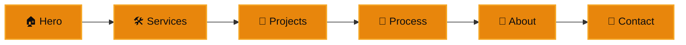

# ⚡ Ivan Vysocinas — Portfolio

<div align="center">


[](https://git.io/typing-svg)

**[ivanvysocinas.dev →](https://ivanvysocinas.dev)**

</div>

## 🚀 About This Project

Source of my personal portfolio — a dark, motion-heavy single-page site with a 3D contact model, horizontal-scroll case studies and a GSAP-driven scroll narrative. Built to actually demonstrate the kind of product work described in it, not just describe it.

<div align="center">


</div>

## ✨ Features

<table>
<tr>
<td width="50%">

### 🎨 Design
- Dark theme, near-black surface with a single amber accent
- Diagonal section wipes + skew-on-scroll-velocity text
- Word-by-word reveal animations, triggered on scroll
- Bilingual — English / Russian, instant switch, no reload
- Fully responsive, mobile-first layout

</td>
<td width="50%">

### ⚡ Engineering
- Smooth-scroll via Lenis, synced to GSAP ScrollTrigger
- Interactive Three.js model in the contact section
- Route-based case study pages with shared page transitions
- Lazy-loaded 3D/heavy sections below the fold
- SEO: OG/Twitter meta, JSON-LD, sitemap, canonical URL

</td>
</tr>
</table>

## 📱 Sections



### 🏠 Hero
Animated tagline reveal with parallax fade-out on scroll

### 🛠️ Services
Four cards — Business Automation, SaaS & High-Load Architecture, Web Applications, Backend & APIs — sliding in with a 3D tilt

### 📂 Projects
Horizontal-scroll, pinned case study gallery, each with its own detail route — problem, solution, results, stack

### 🔄 Process
Vertical timeline with a scroll-filled progress line, cards alternating left/right

### 👤 About
Stats with animated counters and a network-graph visual

### 📧 Contact
Working contact form (Formspree) next to a switchable 3D social model — LinkedIn, GitHub, Telegram, Email

## 🛠️ Tech Stack

<div align="center">

| Category | Technologies |
|----------|-------------|
| **Frontend** | React 18, TypeScript, React Router |
| **Animation** | GSAP + ScrollTrigger, Lenis (smooth scroll) |
| **3D** | Three.js |
| **Build Tool** | Vite |
| **Forms** | Formspree |
| **Icons** | react-icons |

</div>

## 📦 Installation

```bash
# Clone the repository
git clone https://github.com/ivanvysocinas/portfolio2

# Navigate to project directory
cd portfolio2

# Install dependencies
npm install

# Start development server
npm run dev

# Build for production
npm run build

# Preview production build
npm run preview
```

## ⚙️ Configuration

### Contact form (Formspree)

The contact form posts to a Formspree endpoint in [`src/components/Contact.tsx`](src/components/Contact.tsx):

```typescript
await fetch('https://formspree.io/f/your_form_id', {
  method: 'POST',
  body: new FormData(form),
  headers: { Accept: 'application/json' },
});
```

1. Create a form at [Formspree](https://formspree.io/)
2. Swap in your own form ID
3. In the Formspree dashboard, restrict **Allowed Domains** to your production domain to stop direct API spam

## 🎯 Project Structure

```
portfolio2/
├── src/
│   ├── components/
│   │   ├── case-diagrams/       # Custom SVG diagrams per case study
│   │   ├── Hero.tsx
│   │   ├── Services.tsx
│   │   ├── Industries.tsx       # Projects / case studies
│   │   ├── Process.tsx
│   │   ├── About.tsx
│   │   ├── Contact.tsx
│   │   ├── ContactModel.tsx     # Three.js social model
│   │   ├── Navbar.tsx / Footer.tsx
│   │   └── ...
│   ├── i18n/
│   │   ├── en.ts / ru.ts        # All copy, per language
│   │   └── context.tsx
│   ├── pages/
│   │   ├── HomePage.tsx         # Scroll animation orchestration
│   │   └── ProjectPage.tsx      # Case study detail route
│   ├── utils/
│   ├── App.tsx
│   └── main.tsx
└── public/
    ├── *.glb                    # 3D models
    └── projects/                # Case study screenshots
```

## 🤝 Contributing

This is a personal portfolio, but issues and suggestions are welcome.

## 📧 Contact

<div align="center">

[](mailto:ivanvysocinas@gmail.com)
[](https://github.com/ivanvysocinas)
[](https://www.linkedin.com/in/ivan-vysocinas-20716b38a)
[](https://t.me/Bugzers)

</div>

---

<div align="center">

### ⭐ Star this repo if you like it!


Made by [Ivan Vysocinas](https://github.com/ivanvysocinas)


</div>
